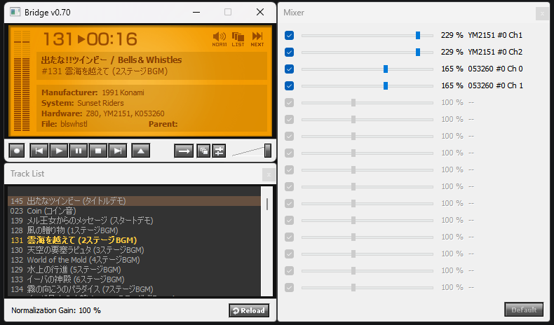

# BridgeM1

BridgeM1 は、アーケードゲーム音楽エミュレーター **M1** 用の Windows フロントエンドです。

ゲームと曲の選択、トラックリスト再生、音量ミキサー、ROM監査、テーマ変更、
WAV出力などの機能を提供します。

## Bridge v0.70

2026年6月20日リリース。

- 最新の開発環境でコンパイルできるよう、18年ぶりにコードを更新
- 高DPI環境とスケーリングに対応
- ウィンドウのスナップ位置を現在のWindowsに合わせて修正
- 表示や操作に関する多数の細かな問題を修正

## 必要なファイル

BridgeM1 の実行には、M1コアの以下のファイルが必要です。

- `m1.dll`
- `m1.xml`

`BridgeM1.exe` と同じディレクトリへ配置してください。

そのほか、次のディレクトリを使用します。

- `lists/`: ゲームごとのトラックリスト
- `themes/`: プレーヤーの表示テーマ
- `m1cfg/`: ゲームまたはドライバーごとのミキサー設定

ROMイメージは本リポジトリに含まれません。

## 使い方

1. `BridgeM1.exe` と同じディレクトリに `m1.dll` と `m1.xml` を配置します。
2. BridgeM1を起動し、OptionsダイアログでROMの検索パスを設定します。
3. ROM Browserの **Rescan** でROMを確認します。
4. ゲームをダブルクリックするか、選択して **OK** を押すと再生を開始します。
5. トラックリストが存在するゲームでは、リストに指定された順序、演奏時間、フェード設定が使用されます。

テーマはメインウィンドウを右クリックし、**Theme** から変更できます。

詳細な設定、リストモード、WAVファイル名設定、FAQ、全更新履歴については
[readme-jp.txt](readme-jp.txt)を参照してください。

## 主なショートカット

| キー | 操作 |
| --- | --- |
| `X` / テンキー `5` / `Enter` | 再生、再スタート、ポーズ解除 |
| `B` / テンキー `6` / テンキー `+` | 次の曲 |
| `Z` / テンキー `4` / テンキー `-` | 前の曲 |
| `Space` | ポーズ、ポーズ解除 |
| テンキー `0` / `O` | ROM Browserを開く |
| `Ctrl+Q` | 終了 |
| `Ctrl+W` | 最小化 |
| `Backspace` | メインウィンドウとトラックリスト間のフォーカス移動 |
| 上下キー | 音量調整 |

## 開発・ビルド

現在の開発および動作確認には **Delphi 12 Community Edition** を使用しています。

1. Delphi 12 Community Editionで `BridgeM1.dproj` を開きます。
2. ターゲットプラットフォームに **Windows 32-bit** を選択します。
3. **プロジェクト > すべてビルド** を実行します。

外部のカスタムVCLコンポーネントは不要です。Delphi 12 Community Editionの
標準ライブラリだけでビルドできます。

Community Editionの利用条件については、Embarcaderoが提示する最新のライセンスを
各自で確認してください。

## ライセンス

BridgeM1のソースコードは[MIT License](LICENSE)で公開します。

MIT Licenseは、著作権表示とライセンス表示を残すことを条件に、利用、改変、再配布、
商用利用を許可します。

M1コア、ゲーム名、会社名、トラックリストなど、第三者が権利を持つ成果物には、
それぞれのライセンスおよび権利条件が適用されます。

本ソフトウェアは無保証で提供されます。利用によって生じた損害について、作者は責任を負いません。

## 作者

Fujix  
<https://www.e2j.net/>
